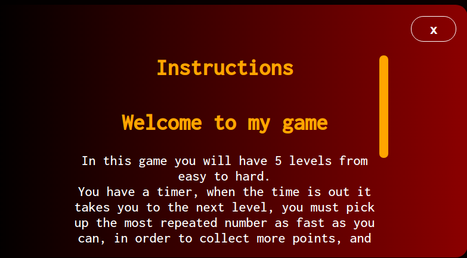
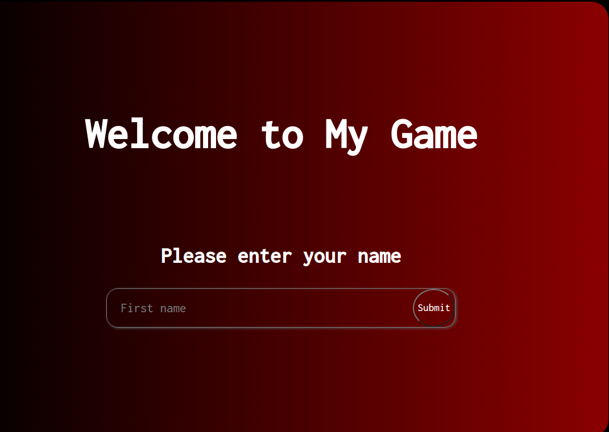
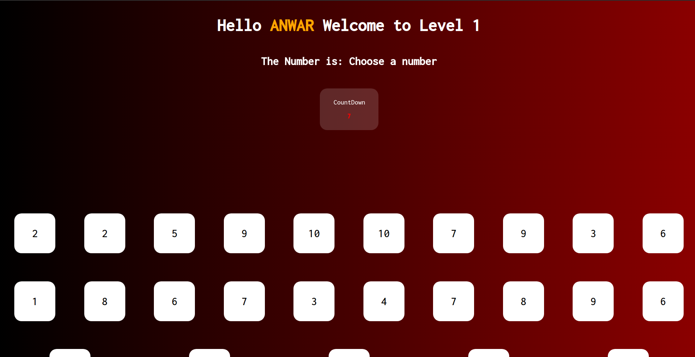
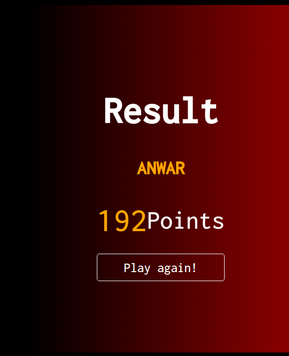

# Numbers game

## Responsive for Mobiles and Desktops

---

## 

## 

## 

## 

## Your App name

**[Test this app yourself](https://atakriti.github.io/number-game/)**

---

#### Navigation

- About Project
  - _Number Game based on Concentration and the speed to pick the most repeated number_
  - _Developed With Anwar Takriti_
- How to use this Project
  - _In this game you will have 3 levels from easy to hard.  
    You have a timer, when the time is out it takes you to the next level, you must pick up the most repeated number as fast as you can,  
     in order to collect more points, and at the end you will be landed to the result to see how much points you got._
- Contact
  - _Mail_
  - _GitHub_
  - _LinkedIn_
- Used Tools
  - _Fonts_
  - _Design_
  - _Icons_
  - _Colors_

---

##### Developed With

- [x] _HTML5_
- [ ] _CSS3_
- [x] _SASS_
- [x] _SCSS_
- [x] _JavaScript_
- [ ] _React_
- [ ] _Bootstrap_
- [x] _npm_
- [ ] _..._

---

### Contact

Mail: <anwart256@gmail.com> 
GitHub: [yourGHName](https://github.com/atakriti) 
LinkedIn: [your linkedIn](#)

---

### Used Tools

- [npm](https://www.npmjs.com/)
- [Google Fonts](https://fonts.google.com/)
- [Visual Studio Code](https://code.visualstudio.com/)

---

Made with ❤️ by me
